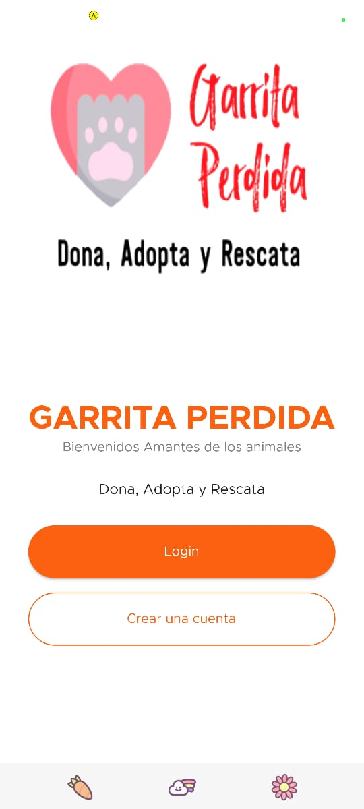
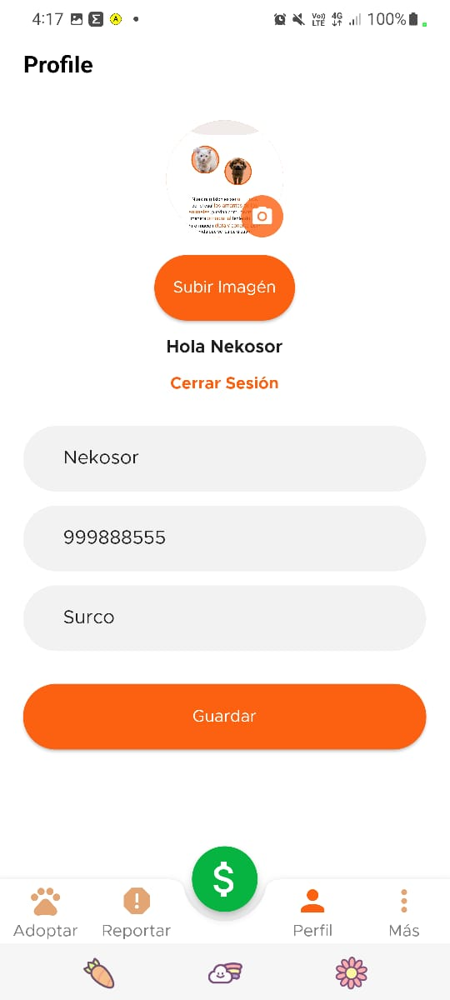

# Garrita Perdida v1.0.0

A new App for Pet Shelters, Donate, Adopt and Rescue. Created using Flutter, Firebase, Firestorage, Bloc as State Management.

# Features :

* Sign-In, Sign-Up and LogOut using Email & Password / Google Account / Facebook Account.
* Using Modular Bloc Architecture, Custom widgets and Clean reusable code.
* Using Bloc(Cubit) as a state management.
* Using Firebase Firestore as a backend.
* Consume APIs.
* Profile, Avatar.
* Image picker - CRUD.
* Soon new features.

## Screen Shots
